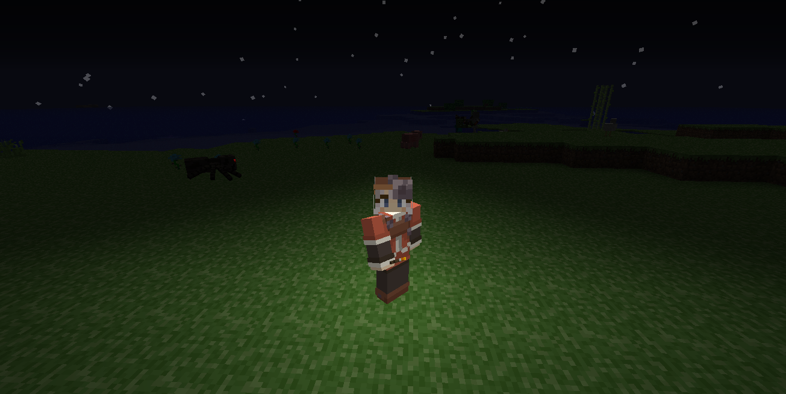
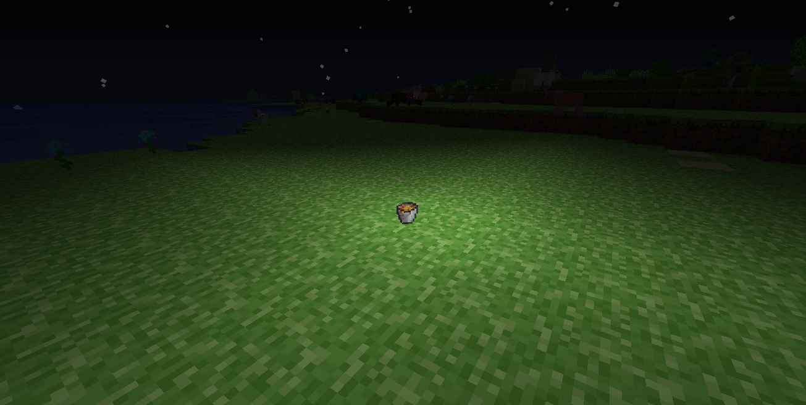
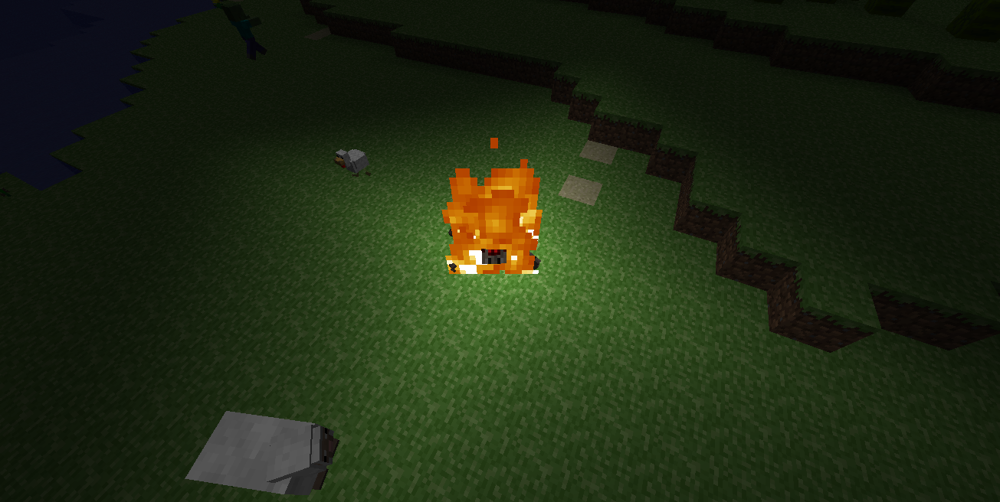

# catroidvaniadynamiclights

a basic client side dynamic lights mod for reindev

requires [foxloader](https://github.com/Fox2Code/FoxLoader)

handheld items emit lights

dropped item emit lights

flaming mobs emit lights (must be enabled in the config for lag reasons)

lit tnt and exploding creepers glow

most blocks that give off light also give off light as dropped and held items
some entities such as fireballs and blazes also emit light

this project is still in development so there may be bugs